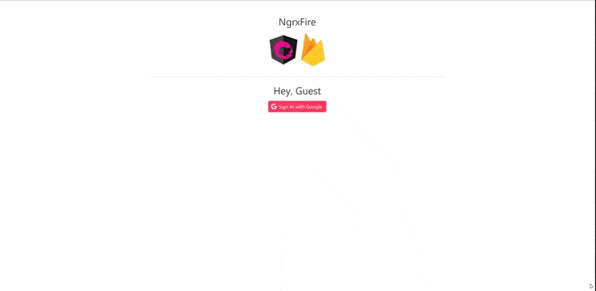

# NgrxFire

NgrxFire is a redux demo app created with Angular Ngrx and Firebase. It demonstrates how to authenticate using Firebase Google OAuth.

## Build your Angular ngrx on a Solid Foundation

Learn Angular ngrx Redux basics by building this app step-by-step. 

- [Video Lessons and Screencasts](https://angularfirebase.com)
- [Join the Slack Team](https://join.slack.com/angularfirebase/shared_invite/MjA2NTgxMTI0MTk2LTE0OTg4NTQ4MDAtMjhhZDIzMjc0Mg)



## Usage

#### Clone repository and prepare to build:

Use the following terminal commands to prepare to build your application:

- `git clone https://github.com/hunteroi/NgrxFire.git`
- `cd NgrxFire`
- `npm install`

#### Create a Firebase account

*  Create a Firebase account at https://firebase.google.com/. 
*  Configure Authentication for the web app:
  >  
*  Create your FireStore database and connect it with your project
  > 1. `firebase login`
  > 2. `firebase init`
  > 3. Follow the steps and choose "Existing project
*  Gather your Firebase configuration information:
  >  
*  Create the environment file below `/src/environments/environment.ts`.
```typescript
export const environment = {
  production: false,
  firebaseConfig: {
    apiKey: "API_KEY",
    authDomain: "AUTH_DOMAIN",
    projectId: "PROJECT_ID",
    storageBucket: "STORAGE_BUCKET",
    messagingSenderId: "MESSAGING_SENDER_ID",
    appId: "APP_ID"
  }
};
```
*  And finally `ng serve`


## Additional Details

This project was generated with [Angular CLI](https://github.com/angular/angular-cli) version 12.0.0. It uses @angular/fire@6.1.5, firebase@8.6.3.

It has been set up on the 29th of May 2021.

Available under the MIT License.


!!! This project is an updated version of [ngrx-fire](https://github.com/codediodeio/ngrx-fire) !!!